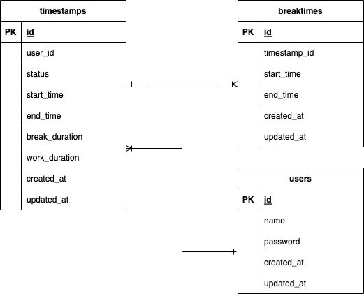

# Atte

## 作成した目的
株式会社〇〇の人事評価のための勤怠管理システムを刷新し、利用者数を増やすため

## アプリケーションURL
http://localhost

## 他のリポジトリ
### GitHub
https://github.com/chie-ichi/trial01.git

## 機能一覧
| 機能名 | 説明 |
|-----------|-----------|
| ユーザー登録 | 勤怠管理システムのユーザー情報を登録 |
| ログイン | Eメールとパスワードで認証し、勤怠管理システムにログインする |
| ログアウト | ログイン状態を解除する |
| 勤務開始 | 勤務開始時刻を記録する |
| 勤務終了 | 勤務終了時刻を記録する |
| 休憩開始 | 休憩開始時刻を記録する |
| 休憩終了 | 休憩終了時刻を記録する |
| 日付別勤怠情報取得 | 日付別に打刻情報を一覧で表示する  ※5件ずつのページネーション表示を行う |

## 使用技術(実行環境)
- PHP 7.4.9
- Laravel 8.83.8
- MySQL 8.0.26
- nginx 1.21.1

## テーブル設計

### タイムスタンプテーブル
| カラム名 | 型 | PRIMARY KEY | UNIQUE KEY | NOT NULL | FOREIGN KEY |
|------|------|------|------|------|------|
| id | bigint unsigned | ◯ | ◯ | ◯ |  |
| user_id | bigint unsigned |  |  | ◯ | ◯ |
| status | tinyint |  |  | ◯ |  |
| start_time | datetime |  |  |  |  |
| end_time | datetime |  |  |  |  |
| break_duration | time |  |  |  |  |
| work_duration | time |  |  |  |  |
| created_at | timestamp |  |  |  |  |
| updated_at | timestamp |  |  |  |  |

### ユーザーテーブル
| カラム名 | 型 | PRIMARY KEY | UNIQUE KEY | NOT NULL | FOREIGN KEY |
|------|------|------|------|------|------|
| id | bigint unsigned | ◯ | ◯ | ◯ |  |
| name | varchar(255) |  |  | ◯ |  |
| password | varchar(255) |  |  | ◯ |  |
| created_at | timestamp |  |  |  |  |
| updated_at | timestamp |  |  |  |  |

### 休憩時間テーブル
| カラム名 | 型 | PRIMARY KEY | UNIQUE KEY | NOT NULL | FOREIGN KEY |
|------|------|------|------|------|------|
| id | bigint unsigned | ◯ | ◯ | ◯ |  |
| timestamp_id | bigint unsigned |  |  | ◯ | ◯ |
| start_time | datetime |  |  |  |  |
| end_time | datetime |  |  |  |  |
| created_at | timestamp |  |  |  |  |
| updated_at | timestamp |  |  |  |  |

## ER図

## 環境構築
### Dockerビルド
1. `git clone git@github.com:chie-ichi/trial01.git`
2. `docker-compose up -d --build`

＊ MySQLは、OSによって起動しない場合があるのでそれぞれのPCに合わせてdocker-compose.ymlファイルを編集してください。

### Laravel環境構築
1. `docker-compose exec php bash`
2. `composer install`
3. .env.exampleファイルから.envを作成し、環境変数を変更
4. `php artisan key:generate`
5. `php artisan migrate`
6. `php artisan db:seed`

### テストユーザー
テストユーザー情報は以下の通り。  
※以下のユーザーは上記のLaravel環境構築作業の手順6を行うと生成される。
| ユーザー名 | Eメール | パスワード |
|-----------|-----------|-----------|
| 田中一郎 | test1@test.jp | password1 |
| 田中二郎 | test2@test.jp | password2 |
| 田中三郎 | test3@test.jp | password3 |
| 田中四郎 | test4@test.jp | password4 |
| 田中五郎 | test5@test.jp | password5 |
| 田中六郎 | test6@test.jp | password6 |
| 田中七郎 | test7@test.jp | password7 |
| 田中八郎 | test8@test.jp | password8 |
| 田中九郎 | test9@test.jp | password9 |
| 田中十郎 | test10@test.jp | password10 |

## 追加実装項目について
AWS（ストレージをS3、バックエンドをEC2、データベースをRDSとして環境を構築する）の項目について実施。  
以下URLよりアクセス可能。  
http://ec2-43-207-236-80.ap-northeast-1.compute.amazonaws.com  
先述のテストユーザー情報のEメールとパスワードにてログイン可能。  
  
基本課題そのものではS3を使用していないが、以下URLにS3のバケットにファイルをアップロードするテストページを作成済み。  
http://ec2-43-207-236-80.ap-northeast-1.compute.amazonaws.com/upload-top

